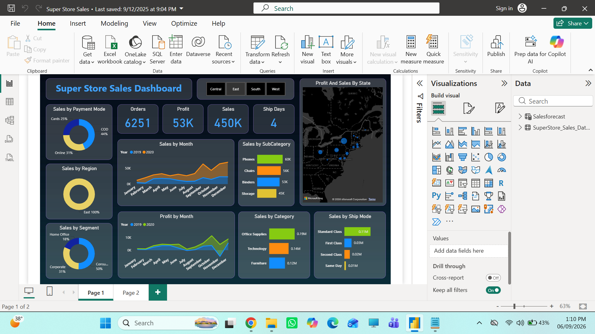

## Dashboard Preview

# Power BI Sales Forecasting Dashboard

## 📌 Project Overview
This Power BI project analyzes supermarket sales data, creates an **interactive dashboard**, and performs **time series forecasting** for the next 15 days. It demonstrates how data cleaning, DAX measures, and visualization techniques can turn raw data into actionable business insights.

## 🎯 Objectives
- Provide valuable insights and accurate sales forecasting using **time series analysis**.
- Create an intuitive and visually appealing dashboard with KPIs and interactive filters.
- Support strategic decision-making through actionable insights and recommendations.

## 📝 Key Features
- **Data Cleaning:** Prepared raw sales data for analysis.
- **DAX Queries:** Created calculated columns/measures for KPIs.
- **Dashboard Creation:** Designed an interactive Power BI dashboard with filters and drill-downs.
- **Sales Forecasting:** Applied time series analysis to predict sales for the next 15 days.
- **Actionable Insights:** Shared insights to improve business growth, efficiency, and customer satisfaction.

## 🛠️ Tools & Technologies
- Power BI
- DAX
- Time Series Analysis

## 📹 Project Walkthrough
Video walkthrough attached to my [LinkedIn post] : https://www.linkedin.com/feed/update/urn:li:activity:7372476282305011712/

## 📂 Repository Contents
- `Dashboard.pbix` – Power BI file of the dashboard.
- `Data/` – Cleaned or sample data used for the project.
- `README.md` – This file.

## 🤝 Feedback
Suggestions and feedback are welcome!  
Feel free to open an issue or connect with me on [url](https://www.linkedin.com/in/irfan-shah-7790a938b/)
